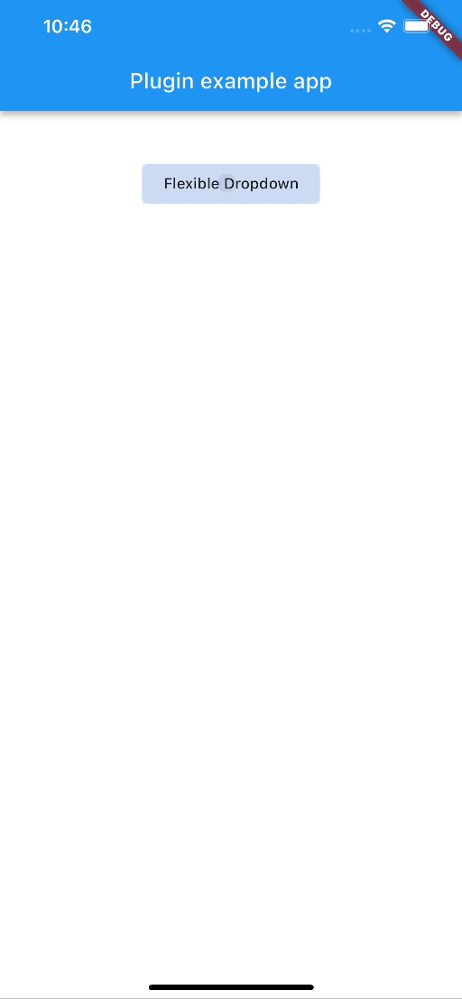
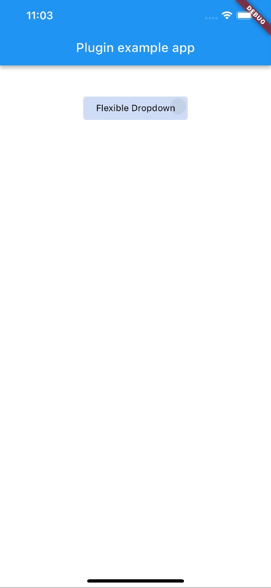
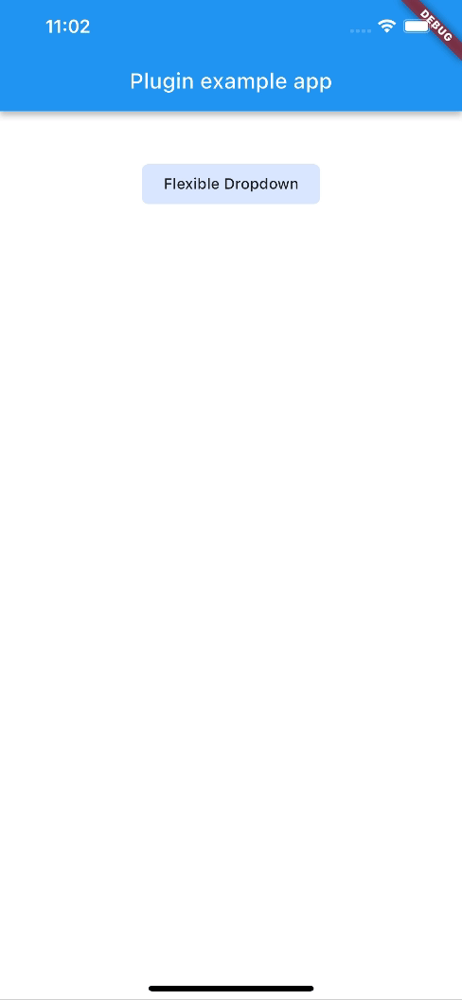

# Flexible Dropdown Package

<div align="left">
<a href="https://pub.dev/packages/flexible_dropdown" rel="noopener" target="_blank"></a>
<a href="https://flutter.dev/" rel="noopener" target="_blank"></a>
</div>


## Features

* Customize dropdown

* Auto scroll to selected item position

* Support `BarrierShape.headerTrans` to highlight the content above the flexible dropdown button

* Allows the dropdown to be dismissed by tapping | panning the scrim or by pressing the escape key on the keyboard.

* Allow to choose the Animation Type

## Installation

First, add `flexible_dropdown` as a [dependency in your pubspec.yaml file](https://flutter.dev/using-packages/).

```yaml
dependencies
  flexible_dropdown: ^1.0.2
```

## Usage

```dart
FlexibleDropdown(
  overlayChild: Container(
    height: 160,
    width: double.infinity,
    color: Colors.deepPurple,
  ),
  barrierColor: Colors.black38.withOpacity(.2),
  barrierShape: BarrierShape.headerTrans,
  textDirection: TextDirection.ltr,
  offset: Offset.zero,
  duration: const Duration(milliseconds: 400),
  animationType: AnimationType.size,
  animationAlignment: Alignment.topCenter,
  child: Container(
    decoration: BoxDecoration(
      borderRadius: BorderRadius.circular(6),
      color: Colors.blueAccent.withOpacity(.2),
    ),
    child: Padding(
      padding: const EdgeInsets.symmetric(vertical: 10, horizontal: 20),
      child: Text(
        title,
        style: const TextStyle(fontSize: 14, fontWeight: FontWeight.w500),
      ),
    ),
  ),
)
```

## Animation Type
|scale|scaleX|scaleY|
|:-------------------------:|:-------------------------:|:-------------------------:|
||||
|size|slide|fade|
||||
|rotate|||
||||

> Note: `AnimationType.size` is only suitable for width of `overlayChild` is full screen width.
